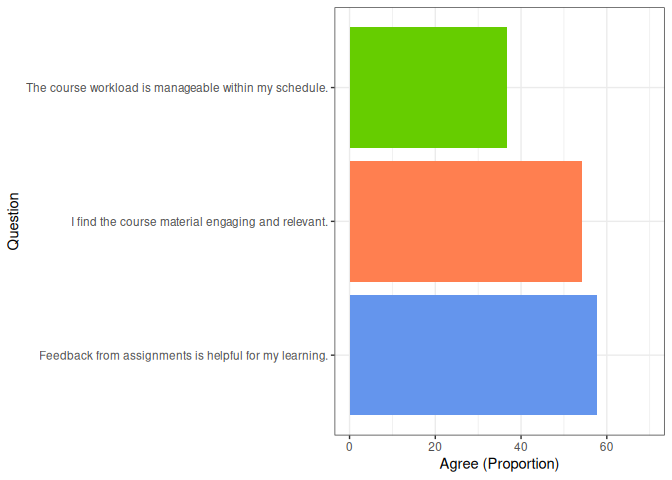

GroupThink
================

## Introduction and Install

GroupThink is a package designed to assist in the analysis in
categorical survey data. It mainly acts as an interface for existing
`tidyverse` functions - but makes it easier to aggregate responses, do
cross-question analysis, and avoid classic mistakes typical of survey
data analysis.

It currently has two functions:`unify()` and `assess()` (though others
are planned for the future…!).

GroupThink isn’t on CRAN, so you’ll need to use `devtools` to install
it. Run:

``` r
install.packages("devtools")
library(devtools)

devtools::install_github("Samuel-Osian-Andrews/GroupThink")
library(GroupThink)
```

As GroupThink is still in development, you should periodically reinstall
the package to get updates.

### Dependencies

GroupThink depends on `dplyr`, `tidyr` and `gt` libraries. If these
aren’t installed automatically when you install GroupThink, you may need
to run:

``` r
install.packages(c("dplyr", "tidyr", "gt"))
```

## GroupThink ‘at a glance’

The `unify()` function groups together Likert-style responses for a
given question or set of questions, returning a summarised output that
contains the n and proportion for each of these groupings.

``` r
unify(data, cols = 1, # ...dataframe name and column index number(s) to analyse
      
      # Below, we 'group' responses via custom grouping labels (e.g. 'Agree'):
      Agree = c("Somewhat agree", "Strongly agree"),
      Disagree = c("Somewhat disagree", "Strongly disagree"),
      Neutral = "Neither agree nor disagree",

      ignore = "Don't know") # ...optionally, set response(s) to ignore from calcs
```

    ## # A tibble: 1 × 7
    ##   Question         `Agree (n)` `Disagree (n)` `Neutral (n)` `Agree (Proportion)`
    ##   <chr>                  <int>          <int>         <int>                <dbl>
    ## 1 I find the cour…          38             32            18                 43.2
    ## # ℹ 2 more variables: `Disagree (Proportion)` <dbl>,
    ## #   `Neutral (Proportion)` <dbl>

The grouping labels can be anything you like. For example, `Agree` could
instead be `Positive`, `Good`, `Satisifed` or something else entirely.
Similarly, `Don't know` could be its own group, instead of being
ignored. You may include as many grouping labels as you’d like.

There’s of course nothing wrong with having just 1 response option per
group (e.g. `"Somewhat agree" = "Somewhat agree"`). The main purpose of
`unify()` is that it forces you to be **intentional** with how you
handle your data, to improve consistency and avoid mistakes.

### Left out responses

If you forgot to include a response in your custom groupings, `unify()`
will throw an error. This is crucial for avoiding mistakes in your
proportion calculations. For example:

``` r
unify(data, 1, Agree = "Somewhat agree",
                #"Strongly agree"), -- let's stop unify() from seeing this line
      Disagree = c("Somewhat disagree", "Strongly disagree"),
      Neutral = "Neither agree nor disagree",
      ignore = "Don't know") 
```

    ## Error in unify(data, 1, Agree = "Somewhat agree", Disagree = c("Somewhat disagree", : The following responses are not accounted for in the provided groups: 'Strongly agree'. Please check your grouping arguments.

As seen above, the output tells you that you forgot to assign “Strongly
agree” to a grouping variable.

### Data for unify()

The `unify()` function expects data that looks like this:

    ## # A tibble: 10 × 3
    ##    I find the course material en…¹ The course workload …² Feedback from assign…³
    ##    <fct>                           <fct>                  <fct>                 
    ##  1 Somewhat disagree               Agree                  Disagree              
    ##  2 Strongly agree                  Disagree               No opinion            
    ##  3 Somewhat agree                  Agree                  <NA>                  
    ##  4 Somewhat disagree               Unsure                 Disagree              
    ##  5 Somewhat agree                  <NA>                   Strongly agree        
    ##  6 Strongly agree                  Neither agree nor dis… <NA>                  
    ##  7 Strongly disagree               Neither agree nor dis… Strongly agree        
    ##  8 Somewhat agree                  Highly disagree        Strongly agree        
    ##  9 Somewhat disagree               Neither agree nor dis… Strongly disagree     
    ## 10 Somewhat agree                  Neither agree nor dis… Agree                 
    ## # ℹ abbreviated names: ¹​`I find the course material engaging and relevant.`,
    ## #   ²​`The course workload is manageable within my schedule.`,
    ## #   ³​`Feedback from assignments is helpful for my learning.`

Responses do not need to be consistently labelled either within or
between different questions/columns, and can contain missing data
(you’ll likely want to assign `NA` to the ignore parameter).

### View column index numbers

Since GroupThink functions work with column **index numbers**, not
column names, you’ll likely want to summarise all index numbers of your
dataset. For this, run `colnames()` from base-R.

``` r
colnames(data)
```

    ## [1] "I find the course material engaging and relevant."    
    ## [2] "The course workload is manageable within my schedule."
    ## [3] "Feedback from assignments is helpful for my learning."

## Benefits of `unify()`

`unify()` is a response to key bottlenecks and common mistakes when
analysing survey data. The function is beneficial because it…

- **Allows for easy groupings.** `unify()` makes it very easy to group
  together different Likert-style responses (e.g. combining
  `Somewhat agree` with `Strongly agree`, or `Excellent` and
  `Very good`). It’s now extremely difficult to make mistakes with
  incorrect groupings, as `unify()` alerts you of any unassigned
  responses.

- **Automates your calculations.** `unify()` handles n and proportion
  calculations for you, meaning you no longer have to undertake complex
  data manipulation tasks, avoiding functions such as `pivot_longer()`,
  which can result in inaccurate figures if you’re not careful!

- **Works with full questions as column headers**. Typically, exporting
  survey responses (such as from Microsoft Forms or SurveyMonkey) will
  leave you with full questions (e.g. “Do you agree or disagree that…”)
  as column headers. This is usually a nightmare to work with in R.
  Because `unify()` works on column indexes, rather than column names,
  you don’t need to worry about recoding your columns or typing out full
  survey questions throughout your code.

- **Gives usable outputs**. `unify()` neatly integrates with ggplot,
  allowing you to visualise your aggregated data. Alternatively, you can
  produce formatted tables through the gtTable argument.

- **Presents clear, readable syntax**. Even for those unfamiliar with R
  syntax, `unify()` makes it very clear exactly how you’ve grouped
  together your responses, improving readability and reproducibility.

- **Means faster insights**. With just a few lines of code, this
  function could save you hours worth of work for large survey projects.

## The `assess()` function

You might find it beneficial to run GroupThink’s `assess()` function,
which provides an overview of the different response options in your
specified columns.

``` r
assess(data, cols = c(2, 3))
```

    ## 
    ## 
    ## Examining the following columns:
    ## 
    ## Column [2]: The course workload is manageable within my schedule.
    ## Column [3]: Feedback from assignments is helpful for my learning.
    ## 
    ## 
    ## 11 unique responses were found across these columns. Please make sure each response
    ## below is accounted for within your `unify()` function call:
    ## 
    ## 
    ## Agree
    ## Disagree
    ## Highly agree
    ## Highly disagree
    ## Indifferent
    ## Neither agree nor disagree
    ## No opinion
    ## Strongly agree
    ## Strongly disagree
    ## Unsure
    ## NA

## Make formatted tables

Using the gtTable argument, `unify()` makes it simple to create nice,
formatted tables.

``` r
unify(data, 1, Agree = c("Somewhat agree", "Strongly agree"),
      Disagree = c("Somewhat disagree", "Strongly disagree"),
      Neutral = "Neither agree nor disagree",
      ignore = "Don't know",
      
      gtTable = TRUE, # ...set gtTable to TRUE
      
      filter = c("Agree", "Disagree"))
```

<div id="hyzfebfvzk" style="padding-left:0px;padding-right:0px;padding-top:10px;padding-bottom:10px;overflow-x:auto;overflow-y:auto;width:auto;height:auto;">
<style>#hyzfebfvzk table {
  font-family: system-ui, 'Segoe UI', Roboto, Helvetica, Arial, sans-serif, 'Apple Color Emoji', 'Segoe UI Emoji', 'Segoe UI Symbol', 'Noto Color Emoji';
  -webkit-font-smoothing: antialiased;
  -moz-osx-font-smoothing: grayscale;
}
&#10;#hyzfebfvzk thead, #hyzfebfvzk tbody, #hyzfebfvzk tfoot, #hyzfebfvzk tr, #hyzfebfvzk td, #hyzfebfvzk th {
  border-style: none;
}
&#10;#hyzfebfvzk p {
  margin: 0;
  padding: 0;
}
&#10;#hyzfebfvzk .gt_table {
  display: table;
  border-collapse: collapse;
  line-height: normal;
  margin-left: auto;
  margin-right: auto;
  color: #333333;
  font-size: 16px;
  font-weight: normal;
  font-style: normal;
  background-color: #FFFFFF;
  width: auto;
  border-top-style: solid;
  border-top-width: 2px;
  border-top-color: #A8A8A8;
  border-right-style: none;
  border-right-width: 2px;
  border-right-color: #D3D3D3;
  border-bottom-style: solid;
  border-bottom-width: 2px;
  border-bottom-color: #A8A8A8;
  border-left-style: none;
  border-left-width: 2px;
  border-left-color: #D3D3D3;
}
&#10;#hyzfebfvzk .gt_caption {
  padding-top: 4px;
  padding-bottom: 4px;
}
&#10;#hyzfebfvzk .gt_title {
  color: #333333;
  font-size: 125%;
  font-weight: initial;
  padding-top: 4px;
  padding-bottom: 4px;
  padding-left: 5px;
  padding-right: 5px;
  border-bottom-color: #FFFFFF;
  border-bottom-width: 0;
}
&#10;#hyzfebfvzk .gt_subtitle {
  color: #333333;
  font-size: 85%;
  font-weight: initial;
  padding-top: 3px;
  padding-bottom: 5px;
  padding-left: 5px;
  padding-right: 5px;
  border-top-color: #FFFFFF;
  border-top-width: 0;
}
&#10;#hyzfebfvzk .gt_heading {
  background-color: #FFFFFF;
  text-align: center;
  border-bottom-color: #FFFFFF;
  border-left-style: none;
  border-left-width: 1px;
  border-left-color: #D3D3D3;
  border-right-style: none;
  border-right-width: 1px;
  border-right-color: #D3D3D3;
}
&#10;#hyzfebfvzk .gt_bottom_border {
  border-bottom-style: solid;
  border-bottom-width: 2px;
  border-bottom-color: #D3D3D3;
}
&#10;#hyzfebfvzk .gt_col_headings {
  border-top-style: solid;
  border-top-width: 2px;
  border-top-color: #D3D3D3;
  border-bottom-style: solid;
  border-bottom-width: 2px;
  border-bottom-color: #D3D3D3;
  border-left-style: none;
  border-left-width: 1px;
  border-left-color: #D3D3D3;
  border-right-style: none;
  border-right-width: 1px;
  border-right-color: #D3D3D3;
}
&#10;#hyzfebfvzk .gt_col_heading {
  color: #333333;
  background-color: #FFFFFF;
  font-size: 100%;
  font-weight: normal;
  text-transform: inherit;
  border-left-style: none;
  border-left-width: 1px;
  border-left-color: #D3D3D3;
  border-right-style: none;
  border-right-width: 1px;
  border-right-color: #D3D3D3;
  vertical-align: bottom;
  padding-top: 5px;
  padding-bottom: 6px;
  padding-left: 5px;
  padding-right: 5px;
  overflow-x: hidden;
}
&#10;#hyzfebfvzk .gt_column_spanner_outer {
  color: #333333;
  background-color: #FFFFFF;
  font-size: 100%;
  font-weight: normal;
  text-transform: inherit;
  padding-top: 0;
  padding-bottom: 0;
  padding-left: 4px;
  padding-right: 4px;
}
&#10;#hyzfebfvzk .gt_column_spanner_outer:first-child {
  padding-left: 0;
}
&#10;#hyzfebfvzk .gt_column_spanner_outer:last-child {
  padding-right: 0;
}
&#10;#hyzfebfvzk .gt_column_spanner {
  border-bottom-style: solid;
  border-bottom-width: 2px;
  border-bottom-color: #D3D3D3;
  vertical-align: bottom;
  padding-top: 5px;
  padding-bottom: 5px;
  overflow-x: hidden;
  display: inline-block;
  width: 100%;
}
&#10;#hyzfebfvzk .gt_spanner_row {
  border-bottom-style: hidden;
}
&#10;#hyzfebfvzk .gt_group_heading {
  padding-top: 8px;
  padding-bottom: 8px;
  padding-left: 5px;
  padding-right: 5px;
  color: #333333;
  background-color: #FFFFFF;
  font-size: 100%;
  font-weight: initial;
  text-transform: inherit;
  border-top-style: solid;
  border-top-width: 2px;
  border-top-color: #D3D3D3;
  border-bottom-style: solid;
  border-bottom-width: 2px;
  border-bottom-color: #D3D3D3;
  border-left-style: none;
  border-left-width: 1px;
  border-left-color: #D3D3D3;
  border-right-style: none;
  border-right-width: 1px;
  border-right-color: #D3D3D3;
  vertical-align: middle;
  text-align: left;
}
&#10;#hyzfebfvzk .gt_empty_group_heading {
  padding: 0.5px;
  color: #333333;
  background-color: #FFFFFF;
  font-size: 100%;
  font-weight: initial;
  border-top-style: solid;
  border-top-width: 2px;
  border-top-color: #D3D3D3;
  border-bottom-style: solid;
  border-bottom-width: 2px;
  border-bottom-color: #D3D3D3;
  vertical-align: middle;
}
&#10;#hyzfebfvzk .gt_from_md > :first-child {
  margin-top: 0;
}
&#10;#hyzfebfvzk .gt_from_md > :last-child {
  margin-bottom: 0;
}
&#10;#hyzfebfvzk .gt_row {
  padding-top: 8px;
  padding-bottom: 8px;
  padding-left: 5px;
  padding-right: 5px;
  margin: 10px;
  border-top-style: solid;
  border-top-width: 1px;
  border-top-color: #D3D3D3;
  border-left-style: none;
  border-left-width: 1px;
  border-left-color: #D3D3D3;
  border-right-style: none;
  border-right-width: 1px;
  border-right-color: #D3D3D3;
  vertical-align: middle;
  overflow-x: hidden;
}
&#10;#hyzfebfvzk .gt_stub {
  color: #333333;
  background-color: #FFFFFF;
  font-size: 100%;
  font-weight: initial;
  text-transform: inherit;
  border-right-style: solid;
  border-right-width: 2px;
  border-right-color: #D3D3D3;
  padding-left: 5px;
  padding-right: 5px;
}
&#10;#hyzfebfvzk .gt_stub_row_group {
  color: #333333;
  background-color: #FFFFFF;
  font-size: 100%;
  font-weight: initial;
  text-transform: inherit;
  border-right-style: solid;
  border-right-width: 2px;
  border-right-color: #D3D3D3;
  padding-left: 5px;
  padding-right: 5px;
  vertical-align: top;
}
&#10;#hyzfebfvzk .gt_row_group_first td {
  border-top-width: 2px;
}
&#10;#hyzfebfvzk .gt_row_group_first th {
  border-top-width: 2px;
}
&#10;#hyzfebfvzk .gt_summary_row {
  color: #333333;
  background-color: #FFFFFF;
  text-transform: inherit;
  padding-top: 8px;
  padding-bottom: 8px;
  padding-left: 5px;
  padding-right: 5px;
}
&#10;#hyzfebfvzk .gt_first_summary_row {
  border-top-style: solid;
  border-top-color: #D3D3D3;
}
&#10;#hyzfebfvzk .gt_first_summary_row.thick {
  border-top-width: 2px;
}
&#10;#hyzfebfvzk .gt_last_summary_row {
  padding-top: 8px;
  padding-bottom: 8px;
  padding-left: 5px;
  padding-right: 5px;
  border-bottom-style: solid;
  border-bottom-width: 2px;
  border-bottom-color: #D3D3D3;
}
&#10;#hyzfebfvzk .gt_grand_summary_row {
  color: #333333;
  background-color: #FFFFFF;
  text-transform: inherit;
  padding-top: 8px;
  padding-bottom: 8px;
  padding-left: 5px;
  padding-right: 5px;
}
&#10;#hyzfebfvzk .gt_first_grand_summary_row {
  padding-top: 8px;
  padding-bottom: 8px;
  padding-left: 5px;
  padding-right: 5px;
  border-top-style: double;
  border-top-width: 6px;
  border-top-color: #D3D3D3;
}
&#10;#hyzfebfvzk .gt_last_grand_summary_row_top {
  padding-top: 8px;
  padding-bottom: 8px;
  padding-left: 5px;
  padding-right: 5px;
  border-bottom-style: double;
  border-bottom-width: 6px;
  border-bottom-color: #D3D3D3;
}
&#10;#hyzfebfvzk .gt_striped {
  background-color: rgba(128, 128, 128, 0.05);
}
&#10;#hyzfebfvzk .gt_table_body {
  border-top-style: solid;
  border-top-width: 2px;
  border-top-color: #D3D3D3;
  border-bottom-style: solid;
  border-bottom-width: 2px;
  border-bottom-color: #D3D3D3;
}
&#10;#hyzfebfvzk .gt_footnotes {
  color: #333333;
  background-color: #FFFFFF;
  border-bottom-style: none;
  border-bottom-width: 2px;
  border-bottom-color: #D3D3D3;
  border-left-style: none;
  border-left-width: 2px;
  border-left-color: #D3D3D3;
  border-right-style: none;
  border-right-width: 2px;
  border-right-color: #D3D3D3;
}
&#10;#hyzfebfvzk .gt_footnote {
  margin: 0px;
  font-size: 90%;
  padding-top: 4px;
  padding-bottom: 4px;
  padding-left: 5px;
  padding-right: 5px;
}
&#10;#hyzfebfvzk .gt_sourcenotes {
  color: #333333;
  background-color: #FFFFFF;
  border-bottom-style: none;
  border-bottom-width: 2px;
  border-bottom-color: #D3D3D3;
  border-left-style: none;
  border-left-width: 2px;
  border-left-color: #D3D3D3;
  border-right-style: none;
  border-right-width: 2px;
  border-right-color: #D3D3D3;
}
&#10;#hyzfebfvzk .gt_sourcenote {
  font-size: 90%;
  padding-top: 4px;
  padding-bottom: 4px;
  padding-left: 5px;
  padding-right: 5px;
}
&#10;#hyzfebfvzk .gt_left {
  text-align: left;
}
&#10;#hyzfebfvzk .gt_center {
  text-align: center;
}
&#10;#hyzfebfvzk .gt_right {
  text-align: right;
  font-variant-numeric: tabular-nums;
}
&#10;#hyzfebfvzk .gt_font_normal {
  font-weight: normal;
}
&#10;#hyzfebfvzk .gt_font_bold {
  font-weight: bold;
}
&#10;#hyzfebfvzk .gt_font_italic {
  font-style: italic;
}
&#10;#hyzfebfvzk .gt_super {
  font-size: 65%;
}
&#10;#hyzfebfvzk .gt_footnote_marks {
  font-size: 75%;
  vertical-align: 0.4em;
  position: initial;
}
&#10;#hyzfebfvzk .gt_asterisk {
  font-size: 100%;
  vertical-align: 0;
}
&#10;#hyzfebfvzk .gt_indent_1 {
  text-indent: 5px;
}
&#10;#hyzfebfvzk .gt_indent_2 {
  text-indent: 10px;
}
&#10;#hyzfebfvzk .gt_indent_3 {
  text-indent: 15px;
}
&#10;#hyzfebfvzk .gt_indent_4 {
  text-indent: 20px;
}
&#10;#hyzfebfvzk .gt_indent_5 {
  text-indent: 25px;
}
</style>
<table class="gt_table" data-quarto-disable-processing="false" data-quarto-bootstrap="false">
  <thead>
    <tr class="gt_col_headings">
      <th class="gt_col_heading gt_columns_bottom_border gt_left" rowspan="1" colspan="1" scope="col" id="Question">Question</th>
      <th class="gt_col_heading gt_columns_bottom_border gt_right" rowspan="1" colspan="1" scope="col" id="Agree (n)">Agree (n)</th>
      <th class="gt_col_heading gt_columns_bottom_border gt_right" rowspan="1" colspan="1" scope="col" id="Disagree (n)">Disagree (n)</th>
      <th class="gt_col_heading gt_columns_bottom_border gt_right" rowspan="1" colspan="1" scope="col" id="Agree (Proportion)">Agree (Proportion)</th>
      <th class="gt_col_heading gt_columns_bottom_border gt_right" rowspan="1" colspan="1" scope="col" id="Disagree (Proportion)">Disagree (Proportion)</th>
    </tr>
  </thead>
  <tbody class="gt_table_body">
    <tr><td headers="Question" class="gt_row gt_left">I find the course material engaging and relevant.</td>
<td headers="Agree (n)" class="gt_row gt_right">38</td>
<td headers="Disagree (n)" class="gt_row gt_right">32</td>
<td headers="Agree (Proportion)" class="gt_row gt_right">43.2</td>
<td headers="Disagree (Proportion)" class="gt_row gt_right">36.4</td></tr>
  </tbody>
  &#10;  
</table>
</div>

## Further functionality

#### Aggregate across multiple columns/questions

You are not restricted to analysing just one question/column with
`unify()`. You can specify multiple columns/questions to use for the
output:

``` r
unify(data, c(1, 2, 3), # ...analyse Columns 1, 2 and 3
      Positive = c("Somewhat agree", "Strongly agree", "Highly agree", "Agree"),
      Negative = c("Somewhat disagree", "Strongly disagree", "Highly disagree",
                   "Disagree"),
      ignore = c(NA, "Don't know", "Unsure", "Neither agree nor disagree",
                 "No opinion", "Indifferent"),
      
      hideN = TRUE) # ...(optional) hide n column from output (a lot cleaner!)
```

    ## # A tibble: 3 × 3
    ##   Question                         Positive (Proportion…¹ Negative (Proportion…²
    ##   <chr>                                             <dbl>                  <dbl>
    ## 1 Feedback from assignments is he…                   57.8                   42.2
    ## 2 I find the course material enga…                   54.3                   45.7
    ## 3 The course workload is manageab…                   36.7                   63.3
    ## # ℹ abbreviated names: ¹​`Positive (Proportion)`, ²​`Negative (Proportion)`

…Just make sure that you’ve accounted for each response option across
your range of columns, otherwise you’ll get an error.

#### Filter out responses from the output only

If you want to only include only some response groups in the output but
not from the calculations, we can use the `filter` argument.

``` r
unify(data, 3,
      Agree = c("Agree", "Strongly agree"),
      Disagree = c("Disagree", "Strongly disagree"),
      Neither = c("No opinion", "Indifferent"),
      ignore = c(NA, "Don't know"),
      
      filter = "Agree") # ...only include the Agree group in the output
```

    ## # A tibble: 1 × 3
    ##   Question                                      `Agree (n)` `Agree (Proportion)`
    ##   <chr>                                               <int>                <dbl>
    ## 1 Feedback from assignments is helpful for my …          37                 38.9

The other variable groupings are used for the calculations, but only
“Agree” responses are shown in the final output.

#### Integrate with ggplot

Unless you’ve set `unify()`’s gt_table() argument to `TRUE`, it will
output as a tibble. This means it integrates neatly into `ggplot()`
function calls.

Let’s pretend we’ve already run `unify()` on columns 1, 2 & 3, and
assigned it to the name `united`…

``` r
ggplot(data = united, # ...unify() output becomes ggplot()'s data argument
       aes(x = Question, y = `Agree (Proportion)`, fill = Question)) +
  geom_col() +
  
  # ...below are just optional customisation options:
  coord_flip() +
  theme_bw() +
  scale_fill_manual(values = c("cornflowerblue", "coral", "chartreuse3")) +
  scale_y_continuous(limits = c(0, 70)) +
  theme(legend.position = "none")
```

<!-- -->

## Even more functionality

For other functionality not covered in this document, please run
`?unify()` and `?assess()` to view the help file, which covers all
function parameters.

## Future plans

- Add support for `stargazer` tables into `unify()`.

- Develop a separate function for analysing multiple choice data for
  data formats typical of exported survey data.

## Bug reports and feature requests

Please do let me know any issues you come across. You can use the
**Issues** tab in GitHub for any bug reports.

If you have any ideas for existing features, or perhaps even new ones,
then I’d love to hear them. Let me know in the **Discussion** tab in
GitHub.

I am also open to invitations to collaborate.
